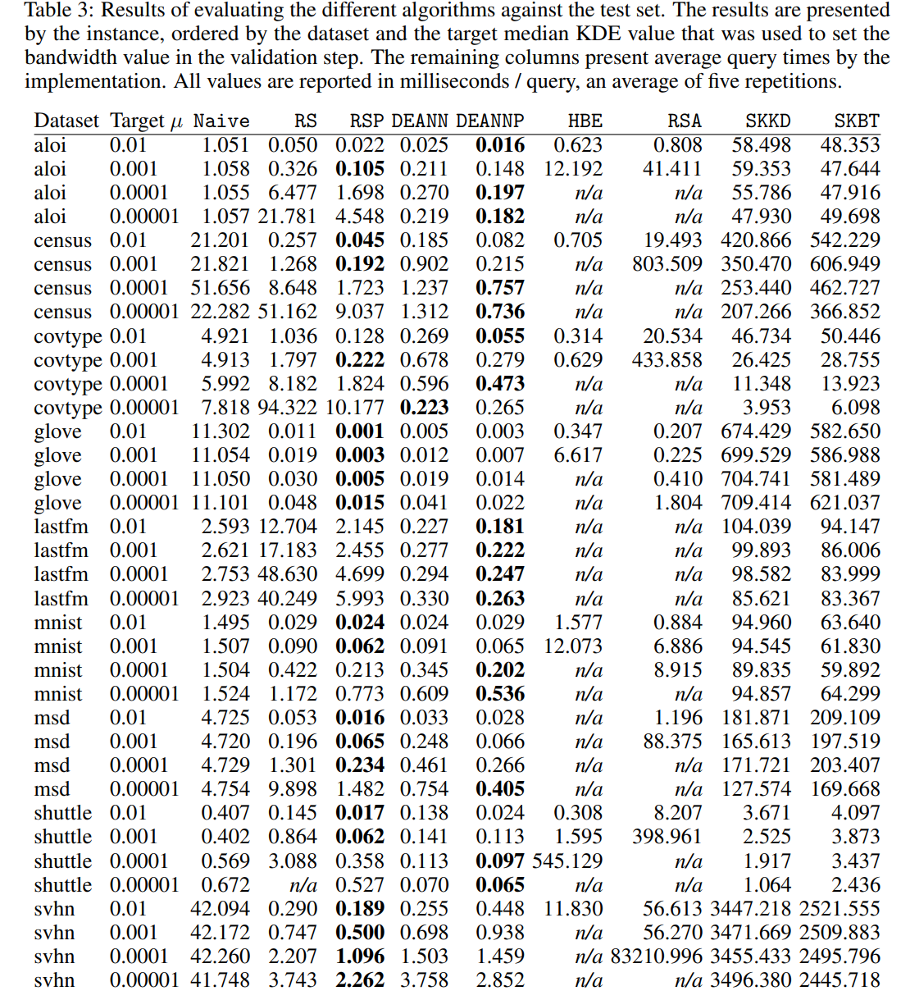

# Experimental Framework for "DEANN - Density Estimation from Approximate Nearest Neighbors"

The following repository contains the infrastructure to benchmark different KDE implementations.

## Implementations

- [DEANN](https://github.com/mkarppa/deann): ANN-based KDE, Random Sampling
- [HBE](https://github.com/kexinrong/rehashing): LSH-based KDE, Random Sampling
- [scikit-learn](https://scikit-learn.org/stable/modules/generated/sklearn.neighbors.KernelDensity.html#sklearn.neighbors.KernelDensity)

## Datasets

| Dataset | Size | Dimensions | 
|:-------:| ---------: | ---------: | 
| ALOI    |   108,000 | 128 |
| Census  | 2,458,285 | 68  |
| Covtype |   581,012 | 54  |
| GloVe   | 1,193,514 | 100 |
| last.fm |   292,385 | 65  |
| MNIST   |    60,000 | 784 |
| MSD     |   515,345 | 90  |
| Shuttle |    58,000 | 9   |
| SVHN    |   531,131 | 3072  |

Each dataset is automatically preprocessed from its raw definition, including bandwidth selection for mean kde values of `0.00001` to `0.01` in steps of `10`.
This happens when running the experiment for the first time on a dataset, or can be invoked explicitly by running 

```
$ python preprocess_dataset.py --dataset shuffle --compute-bandwidth
```

## Intended workflow

### Installation

Requirements:

- Python3
- Docker
- pydocker

The framework is to supposed to be run through Docker. After cloning the repository, build the container as follows: 

``` 
$ pip install pydocker
$ python install.py  
```

The containers will setup all required libraries necessary to run the experiments. 

After building the container, mount the repository and connect to the container as follows:

```
$ docker run -v "$(pwd)":/app/:rw -it deann-experiments
```

### Running experiments

You can run individual experiments using `run_exp.py`. Please invoke `python run_exp.py --help` to get an overview over arguments. 

```
$ python run_exp.py --dataset shuttle
```

takes care of 
(1) preprocessing the `shuttle` dataset, including bandwidth selection for target kde values;
(2) running all algorithms present in `algos.yaml` on the dataset with target kde value `0.01`. 

### Evaluating experiments

```
$ python data_export.py -o res.csv
```

produces a csv file containing results of all runs. The `--help` argument shows how to filter through results. The folder `additional/...` contains scripts to further navigate runs. 

### Running locally

In case that you have a setup that supports running `deann` and `hbe` locally, you do not need to go through the docker environment. Take a look at `Dockerfile` to see which libraries are necessary. In particular, note that `hbe` needs to have an environmental variable set to point at its installation path.

## Evaluation




## Reference

If you found this repository useful in academic work, please cite the following paper: 

- (arXiv link TBA)


